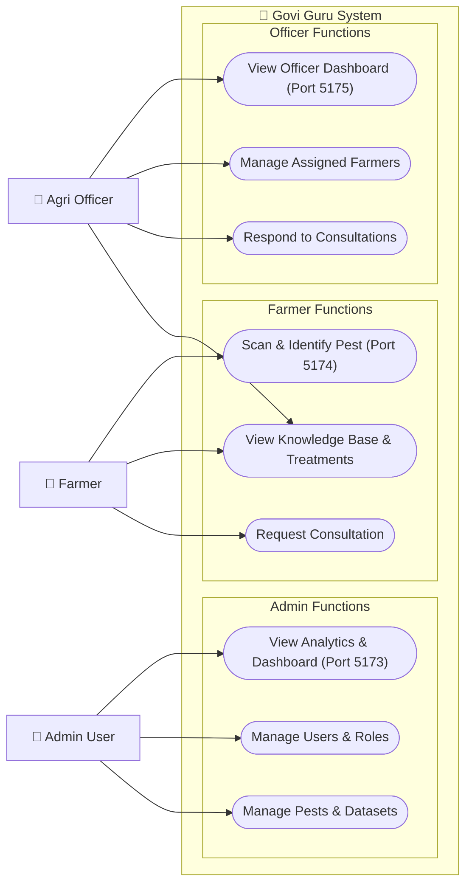
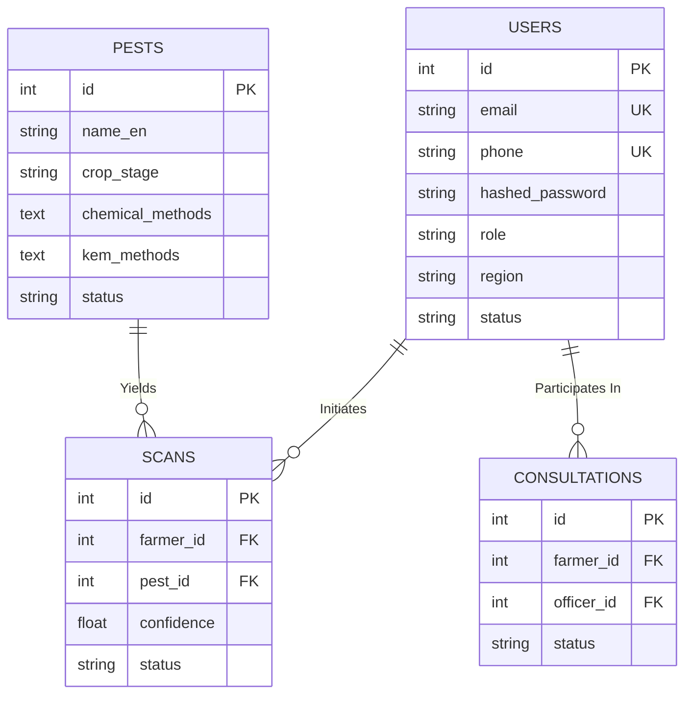

# Govi Guru - Pest Identification & Management System 🌿

Govi Guru is an integrated ecosystem designed to bridge the gap between farmers, agriculture experts, and administrative oversight. The platform features an AI-powered pest detection system combined with farmer-to-officer consultation bridging, educational knowledge bases, and advanced administrative capabilities based on modern React (Vite) frontends and a Python FastAPI backend.

---

## 🏗️ System Architecture

### High-Level Architecture
The system consists of three distinct frontends for separate user personas communicating with a centralized FastAPI backend, backed by MySQL and Object Storage.



### Data Model Structure (ER Diagram)
The unified backend interacts with a centralized relational schema to maintain consistency across the entire Govi Guru network.



---

## 🛠️ Technology Stack

- **Frontend Ecosystem:** React 18, Vite, Tailwind CSS, Radix UI Primitives, Lucide Icons
- **Backend Infrastructure:** Python 3.10+, FastAPI, SQLAlchemy (ORM), Pydantic
- **Database Layer:** MySQL 8.0
- **Object Storage:** MinIO (Local S3 Protocol)
- **Containerization:** Docker & Docker Compose

---

## 🚀 Getting Started

You can run the entire platform quickly using Docker Compose, which builds the microservices locally and provisions the necessary databases.

### Prerequisites
- [Docker](https://www.docker.com/products/docker-desktop/) installed on your machine.
- [Docker Compose](https://docs.docker.com/compose/install/) plugin available.
- Open ports `5173`, `5174`, `5175`, `8000`, `9000`, `9001`, and `3306` on localhost.

### Running with Docker (Recommended Method)

1. Clone the repository and navigate into the project directory:
   ```bash
   git clone <repository_url>
   cd govi-guru
   ```

2. Using Docker Compose, initiate the build and spin up the containers:
   ```bash
   docker compose up --build -d
   ```

3. **Verify the Services**:
   - Backend API is running on [http://localhost:8000](http://localhost:8000). The interactive API docs can be viewed natively at [http://localhost:8000/docs](http://localhost:8000/docs).
   - MySQL is exposed on `localhost:3306`
   - MinIO Storage Console is active on [http://localhost:9001](http://localhost:9001)

### Accessing the Frontends
Once the Docker containers are successfully standing, you can access the three standalone portals via:

| App | Sub-directory | Local URL | Target Description |
| :--- | :--- | :--- | :--- |
| **Admin Portal** | `./admin` | [http://localhost:5173](http://localhost:5173) | System-wide analytics, user & role management |
| **Farmer App** | `./farmer` | [http://localhost:5174](http://localhost:5174) | Pest scanning, knowledge base, consultations |
| **Agri Officer** | `./agriculture` | [http://localhost:5175](http://localhost:5175) | Handling assigned farmers and consultation requests |

*Note: In development, the frontends utilize Vite hot-reloading native mapping, meaning they can be modified locally and updates will propagate instantly within their respective containers.*

---

## 🗄️ Running Services Natively (Without Docker)

If you prefer to run specific components standalone natively, you'll need the foundational backing services (MySQL & Minio) already running.

### 1. Setting up the Backend
```bash
cd backend

# Setup Python Virtual Environment
python3 -m venv .venv
source .venv/bin/activate  # On Windows: .venv\Scripts\activate

# Install Dependencies
pip install -r requirements.txt

# Create .env file based on example
cp .env.example .env

# Run the Uvicorn ASGI Web Server
fastapi dev app/main.py --port 8000
```

### 2. Setting up the Frontends
To run any of the frontends (`admin` / `agriculture` / `farmer`), follow the same Vite launch sequences inside each folder:

```bash
cd <frontend-folder>

# Install Next/React Dependencies
npm install

# Run the Vite Dev Server
npm run dev
```
